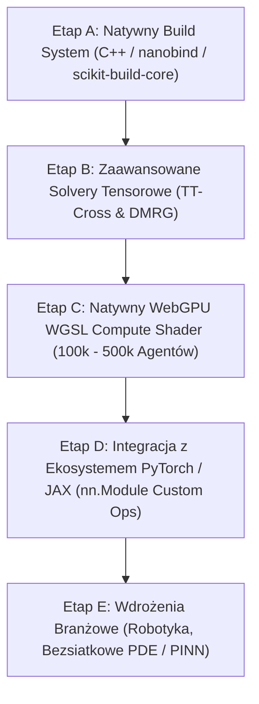

# Strategiczna Roadmapa Rozwoju: Hyper-Symbolic KAN (Kolejne Sesje)

## Spis Treści i Kolejność Realizacji

---

## Szczegółowy Zakres Prac dla Poszczególnych Etapów

### Etap A: Natywny Build System & Standaryzacja C++ / SIMD (Najbliższa sesja)
- **Cel**: Wyeliminowanie fallbacków do Pythona w runtime, zastąpienie `ctypes` nowoczesnymi, bezoverheadowymi bindingami **`nanobind`** oraz standaryzacja procesu budowania przez **`scikit-build-core`** / **`CMake`**.
- **Zadania techniczne**:
  1. Konfiguracja `CMakeLists.txt` z flagami optymalizacyjnymi AVX2 / AVX-512 oraz OpenMP dla platform Windows (MSVC), Linux (GCC/Clang) i macOS (Clang/Apple Silicon).
  2. Implementacja modułu C++ z wykorzystaniem `nanobind` eksportującego szybkie funkcje: `evaluate_tt_kan_batch`, `evaluate_tt_kan_gradient_batch`, `evaluate_cp_kan_batch`.
  3. Konfiguracja `pyproject.toml` z backendem `scikit-build-core` umożliwiającym natywną instalację: `pip install -e .`.
  4. Testy wydajnościowe porównujące narzut wywołania `ctypes` vs `nanobind` vs Python SIMD.

---

### Etap B: Zaawansowane Solvery Tensorowe: Algorytm TT-Cross & DMRG
- **Cel**: Eliminacja ograniczenia gęstego próbkowania siatki w ALS i skalowanie do wymiarów $D = 20 \dots 100$.
- **Zadania techniczne**:
  1. Implementacja algorytmu **TT-Cross (Oseledets)** opartego na macierzach interpolacji maksymalnej objętości (MaxVol).
  2. Implementacja jednowęzłowego i dwuwęzłowego **DMRG** (*Density Matrix Renormalization Group*) do bezgradientowego dopasowywania pól w wysokich wymiarach.
  3. Redukcja złożoności próbkowania z $O(N^D)$ do $O(D \cdot R^2 \cdot K)$ punktów.

---

### Etap C: Natywny WebGPU WGSL Compute Shader Pipeline (100k+ Agentów)
- **Cel**: Przeniesienie symulacji fizycznej i nawigacji roju cząstek w 100% do pamięci VRAM na karcie graficznej.
- **Zadania techniczne**:
  1. Napisanie dedykowanego kernela **WGSL Compute Shader** (`@compute @workgroup_size(64)`), który wykonuje rekurencję Czebyszewa, ewaluację gradientu $\nabla f$ i integrację kroków pozycji w GPU.
  2. Zastosowanie `GPUBuffer` typu `STORAGE | VERTEX` umożliwiającego bezpośrednie renderowanie pozycji cząstek bez transferu danych GPU $\leftrightarrow$ CPU.
  3. Zwiększenie liczby symulowanych agentów z 10 000 do **100 000 – 500 000 agentów w 60 FPS**.

---

### Etap D: Integracja z Ekosystemem PyTorch / JAX
- **Cel**: Umożliwienie bezproblemowego stosowania pól KAN w potokach Deep Learning.
- **Zadania techniczne**:
  1. Utworzenie klasy `ContinuousKANFieldLayer(torch.nn.Module)`.
  2. Dedykowany `torch.autograd.Function` przekazujący analityczne pochodne $\nabla f$ bezpośrednio do wstecznej propagacji bez konieczności automatycznego różniczkowania pamięciochłonnych grafów obliczeniowych.
  3. Eksport wytrenowanych modeli do formatu `.safetensors`.

---

### Etap E: Aplikacje Praktyczne & Wdrożenia Branżowe
- **Cel**: Demonstracja przewagi technologii w zastosowaniach przemysłowych.
- **Zadania techniczne**:
  1. **Robotyka / Drony (Zero-Collision Trajectory Planner)**: Sprzężenie pola KAN z funkcjami barierowymi CBF (*Control Barrier Functions*) do planowania trajektorii w czasie rzeczywistym ($< 0.1\text{ ms}$).
  2. **Physics-Informed Neural Fields (Bezsiatkowe PDE)**: Rozwiązywanie stacjonarnych równań Poissona, Laplace'a i Naviera-Stokesa poprzez analityczny operator Laplace'a $\nabla^2 f$ w 0 epokach gradientowych.
