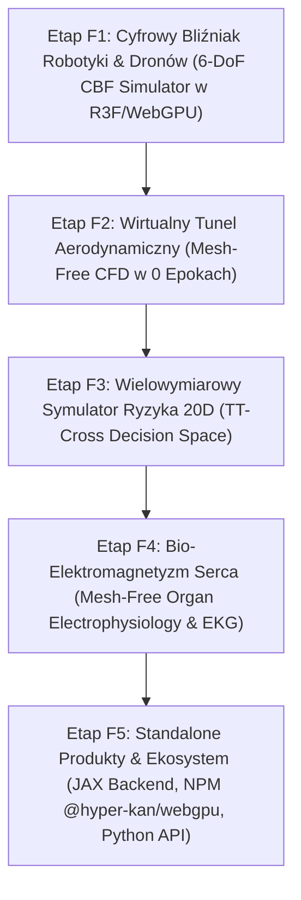

# Strategic Roadmap: Phase II - Industrial Applications & Showcase Ecosystem

## Szczegółowy Zakres Prac Fazy II

### Etap F1: Cyfrowy Bliźniak Robotyki (Interactive 6-DoF CBF Drone & Obstacle Simulator)
- **Moduł**: `web_showcase/src/components/scenarios/RoboticsCBFScenario.tsx`
- **Kluczowe mechanizmy**:
  - Implementacja kinematycznego i dynamicznego filtru barierowego HOCBF 2. rzędu w przeglądarce.
  - Interaktywny dron 3D unikający dynamicznie przesuwanych przeszkód w 120 FPS.
  - Wizualizacja analitycznych wektorów barierowych $\nabla h(x)$ i pól guidance omijania punktów siodłowych.

### Etap F2: Wirtualny Tunel Aerodynamiczny (Mesh-Free Real-Time CFD w 0 Epokach)
- **Moduł**: `web_showcase/src/components/scenarios/AerodynamicsCFDScenario.tsx`
- **Kluczowe mechanizmy**:
  - Zastosowanie spektralnego solvera Poissona w 0 epokach do natychmiastowego obliczania opływu profilu NACA.
  - Dynamiczne linie prądu (streamlines), ciśnienie na powierzchni i obliczanie współczynników $C_L / C_D$ w czasie rzeczywistym.

### Etap F3: Wielowymiarowy Symulator Ryzyka 20D (High-Dim TT-Cross Decision Space)
- **Moduł**: `web_showcase/src/components/scenarios/FinancialRisk20DScenario.tsx`
- **Kluczowe mechanizmy**:
  - Rzutowanie 20-wymiarowej hiperpowierzchni wyceny portfela do 3D.
  - Stress-Testing z analityczną ewaluacją wrażliwości rynkowych (Greeks: Delta, Gamma, Vega) w 1 $\mu$s.

### Etap F4: Bio-Elektromagnetyzm Serca (Mesh-Free Electrophysiology & Synthetic EKG)
- **Moduł**: `web_showcase/src/components/scenarios/CardioElectrophysiologyScenario.tsx`
- **Kluczowe mechanizmy**:
  - Model fali pobudzenia w komorach serca skompresowany w tensorze KAN (18 KB).
  - Interaktywna ablacja RF i syntetyczny wykres 12-odprowadzeniowego EKG.

### Etap F5: Standalone Produkty & Ekosystem
- **Moduły**: `src/jax_kan/`, `@hyper-kan/webgpu`, `import hyper_kan as hk`
- **Kluczowe mechanizmy**:
  - Wsparcie dla ekosystemu JAX (`jax.custom_vjp`).
  - Dystrybucja pakietu npm `@hyper-kan/webgpu`.
  - Publiczny benchmark porównawczy z `pykan` i `efficient-kan`.
